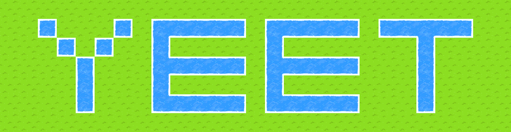
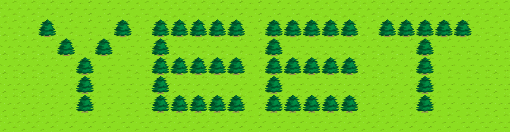

# Neoquest II Map Renderer

This code is a map renderer of the Neopets game, [Neoquest II](http://www.neopets.com/games/nq2/nq2.phtml).

This was a small weekend project. It's is reusable and extendable for any creative types.

An unexpected drawback was figuring out how to do the water's edges. *(Where water meets something that is not water *or water-like*, the sprite changes to have a more natural coastline.)* That code could be improved, but I couldn't be bothered since the performance only really goes downhill when there's a LOT of adjacent water.

I might build on this more and use it in my Discord bot or something someday!

## Installation
**Python 3.8 or higher is needed** *possibly lower, didn't check*

This project will likely never be put on PyPI, so you'll have to install the development version, from this repo.

```sh
python -m pip install -U git+https://github.com/diceroll123/nq2-renderer.py
```

*Alternatively,*

```sh
$ git clone https://github.com/diceroll123/nq2-renderer.py
$ cd dti.py
$ python -m pip install -U .
```
    
## Demo

Running `python main.py` will output you with the following image using the `test-water.json` file in the `data` folder, you'll see a good example of the water edge detection in action:



---

If you modify main.py to render `test.json`, it'll render the word `YEET` using trees on grass.

